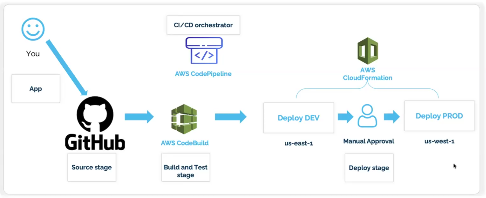

# CI/CD Pipeline with GitHub, AWS CodeBuild, CodePipeline & CloudFormation
### Architecture Review

This project demonstrates a complete CI/CD pipeline using:
- **GitHub** for source control
- **AWS CodePipeline** for orchestration
- **AWS CodeBuild** for build/test
- **AWS CloudFormation** for infrastructure deployment

## Architecture Flow

1. Developer pushes code to GitHub
2. GitHub webhook triggers AWS CodePipeline
3. CodePipeline pulls source from GitHub
4. CodeBuild compiles, tests, and packages the application
5. CloudFormation deploys the infrastructure and application

## Prerequisites

- AWS CLI configured with appropriate permissions
- GitHub repository
- AWS account with necessary IAM permissions

## Setup Instructions

### 1. GitHub Setup
- Create a GitHub repository
- Generate a personal access token with repo permissions
- Store the token in AWS Systems Manager Parameter Store

### 2. AWS Setup
- Deploy the CloudFormation templates in order:
  1. `infrastructure/iam-roles.yaml` - IAM roles and policies
  2. `infrastructure/codebuild-project.yaml` - CodeBuild project
  3. `infrastructure/codepipeline.yaml` - CodePipeline setup

### 3. Application Deployment
- The pipeline will automatically deploy your application using the CloudFormation template in `infrastructure/app-infrastructure.yaml`

## Files Structure

```
ci-cd-pipline/
├── buildspec.yml                    # CodeBuild build specification
├── infrastructure/
│   ├── iam-roles.yaml              # IAM roles and policies
│   ├── codebuild-project.yaml      # CodeBuild project setup
│   ├── codepipeline.yaml           # CodePipeline configuration
│   └── app-infrastructure.yaml     # Application infrastructure
├── src/                            # Sample application code
└── scripts/                        # Deployment scripts
```

## Deployment Commands

```bash
# 1. Deploy IAM roles
aws cloudformation deploy --template-file infrastructure/iam-roles.yaml --stack-name cicd-iam-roles --capabilities CAPABILITY_IAM

# 2. Deploy CodeBuild project
aws cloudformation deploy --template-file infrastructure/codebuild-project.yaml --stack-name cicd-codebuild --capabilities CAPABILITY_IAM

# 3. Deploy CodePipeline
aws cloudformation deploy --template-file infrastructure/codepipeline.yaml --stack-name cicd-pipeline --capabilities CAPABILITY_IAM --parameter-overrides GitHubToken=your-github-token GitHubRepo=your-repo GitHubOwner=your-username
```